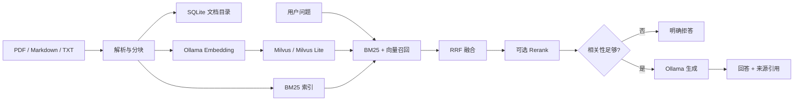

# 洞察者 Insight

[](https://github.com/zhenkun26/Insight/actions/workflows/ci.yml)


洞察者 Insight 是一个面向气象业务资料的 local-first RAG 应用示例。它支持在本地导入 PDF、Markdown 和 TXT 资料，使用 BM25 与向量检索进行混合召回，并返回带来源引用的问答结果。项目自带的气象资料均为合成演示内容，不代表任何官方业务规范。

## 使用场景

- 在本地检索观测说明、预警信号说明和数据处理流程。
- 观察关键词检索、语义检索、RRF 融合和可选重排序的完整链路。
- 在没有可靠证据时返回拒答，而不是让模型自由补充事实。

## 架构



## 核心功能

- 文档上传、列表、删除和重建索引。
- PDF 页码、Markdown 标题和文本块元数据保留。
- BM25 + 向量召回、RRF 融合、Top-K、阈值和可选 Rerank。
- `/chat`、`/chat/stream`、`/search`、文档管理和 `/health`。
- Ollama、Milvus 和 Rerank 均通过 adapter 隔离，测试可使用 fake/mock。
- 评估脚本输出实际运行得到的 hit rate、MRR 和平均延迟；README 不预填性能指标。

## 技术栈

Python 3.11+、FastAPI、Pydantic、Uvicorn、Ollama HTTP API、Milvus/Milvus Lite、BM25、SQLite、pytest、Docker Compose 和 GitHub Actions。

## 项目目录

```text
app/
├── api/          # FastAPI routes
├── core/         # environment settings
├── ingestion/    # parsers and chunking
├── models/       # domain models
├── retrieval/    # BM25, vector, hybrid fusion
├── schemas/      # API schemas
└── services/     # catalog, Ollama, ingestion, QA
data/
├── sample_docs/  # synthetic demo documents
└── uploads/      # local runtime uploads
scripts/evaluate.py
tests/
Dockerfile
docker-compose.yml
pyproject.toml
```

## 本地运行

需要 Python 3.11+。推荐使用虚拟环境和 uv：

```bash
uv venv
source .venv/bin/activate
uv pip install -e ".[dev]"
cp .env.example .env
uvicorn app.main:app --reload
```

如果不安装或不启动外部模型，应用仍可以启动并使用关键词检索；问答和向量召回会根据依赖状态返回明确结果。

## Ollama 模型准备

安装 Ollama 后准备一个生成模型和一个 embedding 模型：

```bash
ollama pull llama3.2:3b
ollama pull nomic-embed-text
```

通过 `.env` 配置 `LLM_BASE_URL`、`LLM_MODEL` 和 `EMBEDDING_MODEL`。模型名称、地址、Top-K、阈值和超时都不写死在业务代码中。

## Milvus

本地开发可以将 `MILVUS_URI` 指向 Milvus Lite 文件路径；使用 Docker Compose 时：

```bash
docker compose up -d milvus
uvicorn app.main:app --reload
```

完整 API 容器和 Milvus 依赖可一起启动：

```bash
docker compose up --build
```

首次启动或切换 embedding 模型后，建议调用重建索引接口。不同 embedding 模型的向量维度可能不同，不能直接复用旧集合。

## 导入文档

```bash
curl -X POST http://localhost:8000/documents/upload \
  -F "file=@data/sample_docs/typhoon-warning.md"

curl http://localhost:8000/documents
curl -X POST http://localhost:8000/documents/reindex
```

## 搜索与问答

```bash
curl -X POST http://localhost:8000/search \
  -H 'Content-Type: application/json' \
  -d '{"query":"台风预警信号分为几级？","top_k":5}'

curl -X POST http://localhost:8000/chat \
  -H 'Content-Type: application/json' \
  -d '{"query":"台风预警信号分为几级？"}'
```

问答响应包含 `answer`、`sources`、`retrieval_results`、`query`、`latency_ms` 和 `status`。来源包括文件名、页码（可用时）、章节和文本块 ID。没有达到阈值的上下文时，系统返回“当前知识库中没有足够信息”语义的拒答。

## 测试

```bash
pytest
ruff check app tests scripts
python -c "from app.main import app; print(app.title)"
```

默认测试不连接真实 Ollama、Milvus 或外部 API。API 测试在安装完整依赖后执行；如果 FastAPI 尚未安装，相关测试会被标记为 skipped，而不是伪造通过。

## 评估

评估数据位于 `data/eval_questions.json`，包含 10 条问题及期望命中文件和关键内容。运行：

```bash
python scripts/evaluate.py --output data/eval-result.json
```

脚本实时计算 hit rate、MRR、平均检索延迟，并记录运行日期、模型配置和参数。当前仓库不预置或声称任何准确率、延迟或模型压缩指标；这些数值会随语料、模型和硬件变化。

## 已知限制

- PDF 标题识别依赖文档文本层，扫描图片 PDF 需要 OCR 扩展。
- Milvus 集合的向量维度必须与当前 embedding 模型一致，切换模型后需要重建索引。
- 当前没有用户认证、权限控制、前端界面和多租户能力。
- Rerank 目前是可选 adapter；模型不可用时保留混合检索顺序并记录 fallback。
- 合成演示资料不能替代正式气象业务规范。

## 后续规划

- 增加 OCR 和更稳健的章节识别。
- 增加可选 LangGraph 状态图和节点级追踪。
- 增加真实公开资料的许可与来源管理。
- 增加可选的跨编码器 Rerank 和更系统的离线评估集。
