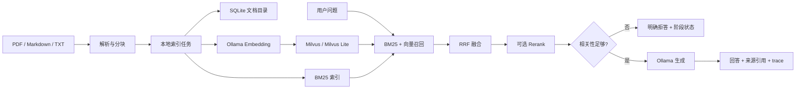

# 洞察者 Insight

[](https://github.com/zhenkun26/Insight/actions/workflows/ci.yml)


洞察者 Insight 是一个面向气象业务资料的 local-first RAG 应用示例。它支持在本地导入 PDF、Markdown 和 TXT 资料，使用 BM25 与向量检索进行混合召回，并返回带来源引用的问答结果。项目自带的气象资料均为合成演示内容，不代表任何官方业务规范。

## 使用场景

- 在本地检索观测说明、预警信号说明和数据处理流程。
- 观察关键词检索、语义检索、RRF 融合和可选重排序的完整链路。
- 在没有可靠证据时返回拒答，而不是让模型自由补充事实。

## 架构



## 核心功能

- 文档上传、列表、删除和重建索引。
- PDF 页码、Markdown 标题和文本块元数据保留。
- 可选扫描 PDF OCR：默认关闭，启用后只处理没有文本层的页面。
- BM25 + 向量召回、RRF 融合、Top-K、阈值和可选 Rerank。
- 可选 Ollama 模型重排：设置 `RERANKER_MODEL` 后按候选片段评分；模型失败自动保留 RRF 顺序。
- `/chat`、`/chat/stream`、`/search`、文档管理和 `/health`。
- Ollama、Milvus 和 Rerank 均通过 adapter 隔离，测试可使用 fake/mock。
- 索引任务支持后台执行、状态轮询、失败重试、内容指纹幂等和模型版本变更提示。
- 文档支持来源/标签过滤，搜索支持分页；问答支持可选会话上下文和 SSE 事件流。
- RAG 工作流返回 query analysis、retrieval、rerank、relevance check、generation/fallback 阶段信息。
- 评估脚本输出实际运行得到的 hit rate、MRR、拒答准确性和平均延迟；README 不预填性能指标。
- 内置无 Node 依赖的本地 Web Console，可直接完成资料导入、混合检索和流式问答演示。

## 技术栈

Python 3.11+、FastAPI、Pydantic、Uvicorn、Ollama HTTP API、Milvus/Milvus Lite、BM25、SQLite、pytest、Docker Compose 和 GitHub Actions。

## 项目目录

```text
app/
├── api/          # FastAPI routes
├── core/         # environment settings
├── ingestion/    # parsers and chunking
├── models/       # domain models
├── retrieval/    # BM25, vector, hybrid fusion
├── schemas/      # API schemas
├── services/     # catalog, Ollama, ingestion, jobs, sessions, QA
├── web/          # dependency-free local browser console
└── workflows/    # explicit RAG stage state
data/
├── sample_docs/  # synthetic demo documents
└── uploads/      # local runtime uploads
scripts/evaluate.py
tests/
Dockerfile
docker-compose.yml
pyproject.toml
```

## 本地运行

需要 Python 3.11+。推荐使用虚拟环境和 uv：

```bash
uv venv
source .venv/bin/activate
uv pip install -e ".[dev]"
cp .env.example .env
uvicorn app.main:app --reload
```

启动后打开 [http://localhost:8000/](http://localhost:8000/)，即可使用本地 Web Console。页面不需要 Node.js、前端构建命令或外部 CDN；它与 FastAPI 使用同源请求，上传后会自动轮询索引任务，并在问答区展示 SSE 片段、来源和阶段状态。也可以继续使用 `/docs` 查看完整 API。

如果不安装或不启动外部模型，应用仍可以启动并使用关键词检索；问答和向量召回会根据依赖状态返回明确结果。

完整版本的上传和重建索引默认返回后台任务，不阻塞 HTTP 请求。可通过 `/jobs/{job_id}` 轮询状态；进程重启后未完成的任务会被标记为可重试失败。

## Ollama 模型准备

安装 Ollama 后准备一个生成模型和一个 embedding 模型：

```bash
ollama pull llama3.2:3b
ollama pull nomic-embed-text
```

通过 `.env` 配置 `LLM_BASE_URL`、`LLM_MODEL` 和 `EMBEDDING_MODEL`。模型名称、地址、Top-K、阈值和超时都不写死在业务代码中。

### 可选扫描 PDF OCR

扫描版 PDF 没有文本层时，可以额外安装本机 OCR 工具并显式开启：

```bash
# macOS
brew install poppler tesseract

# Debian/Ubuntu
sudo apt-get install poppler-utils tesseract-ocr
```

中文资料还需要安装对应的 Tesseract 语言包，并确保 `pdftoppm`、`tesseract` 位于 `PATH`。在 `.env` 中设置：

```dotenv
OCR_ENABLED=true
OCR_LANGUAGE=chi_sim+eng
OCR_TIMEOUT_SECONDS=30
# 可选：指定 OCR 临时目录的父目录
OCR_TEMP_DIR=
```

OCR 默认关闭，不会影响普通 PDF、Markdown 和 TXT。启用后系统仅 OCR 文本层为空的 PDF 页面；工具缺失、超时或命令失败会让索引任务失败并返回 `ocr_unavailable`、`ocr_timeout` 或 `ocr_failed` 语义。启用 OCR 后建议对已有扫描资料执行一次重建索引。Docker 镜像不会强制安装这些系统工具，需自行制作带 OCR 运行时的镜像。

## Milvus

本地开发可以将 `MILVUS_URI` 指向 Milvus Lite 文件路径；使用 Docker Compose 时：

```bash
docker compose up -d milvus
uvicorn app.main:app --reload
```

完整 API 容器和 Milvus 依赖可一起启动：

```bash
docker compose up --build
```

首次启动或切换 embedding 模型后，建议调用重建索引接口。不同 embedding 模型的向量维度可能不同，不能直接复用旧集合。

## 导入文档

```bash
curl -X POST http://localhost:8000/documents/upload \
  -F "file=@data/sample_docs/typhoon-warning.md"

curl http://localhost:8000/documents
curl -X POST http://localhost:8000/documents/reindex

# 上传/重建响应中的 job_id
curl http://localhost:8000/jobs/<job_id>
curl -X POST http://localhost:8000/jobs/<job_id>/retry
curl -X POST http://localhost:8000/jobs/<job_id>/cancel

# 更新来源和标签
curl -X PATCH http://localhost:8000/documents/<document_id>/metadata \
  -H 'Content-Type: application/json' \
  -d '{"source":"demo","tags":["typhoon"],"description":"synthetic demo"}'
```

## 搜索与问答

```bash
curl -X POST http://localhost:8000/search \
  -H 'Content-Type: application/json' \
  -d '{"query":"台风预警信号分为几级？","top_k":5}'

curl -X POST http://localhost:8000/chat \
  -H 'Content-Type: application/json' \
  -d '{"query":"台风预警信号分为几级？"}'

# 按标签过滤并分页
curl -X POST http://localhost:8000/search \
  -H 'Content-Type: application/json' \
  -d '{"query":"预警","tag":"typhoon","offset":0,"top_k":5}'

# SSE 流式问答
curl -N -X POST http://localhost:8000/chat/stream \
  -H 'Content-Type: application/json' \
  -d '{"query":"台风预警信号分为几级？","session_id":"demo-session"}'
```

问答响应包含 `answer`、`sources`、`retrieval_results`、`query`、`latency_ms` 和 `status`。来源包括文件名、页码（可用时）、章节和文本块 ID。没有达到阈值的上下文时，系统返回“当前知识库中没有足够信息”语义的拒答。
完整版响应还包含 `trace_id`、`stages` 和 `retrieval_status`。`/chat/stream` 使用 `text/event-stream`，事件包括 `start`、`retrieval`、`source`、`token` 和 `complete`；配置了 Ollama 时会使用原生 NDJSON 流式片段，并在连接异常时标记 fallback。queued 索引任务可以取消，running 任务不会被强制终止。会话历史只辅助当前问题理解，不会替代当前轮次的检索证据。

### 可选模型重排

默认不调用重排模型。需要使用本地 Ollama 对混合召回候选进行相关性评分时，设置：

```dotenv
ENABLE_RERANK=true
RERANKER_MODEL=<本地重排模型名>
CANDIDATE_K=20
```

系统要求模型只返回 `0..1` 的单个数字；模型不可用、超时或输出无法解析时，会保留重排前的 RRF 顺序，并在 `retrieval_status.rerank` 中记录 `fallback`。模型重排按候选逐条调用 Ollama，可能增加延迟，建议从较小的 `CANDIDATE_K` 开始。清空 `RERANKER_MODEL` 可回退到不需要模型的确定性关键词重排。

## 测试

```bash
pytest
ruff check app tests scripts
python -c "from app.main import app; print(app.title)"
```

默认测试不连接真实 Ollama、Milvus 或外部 API。API 测试在安装完整依赖后执行；如果 FastAPI 尚未安装，相关测试会被标记为 skipped，而不是伪造通过。

## 评估

评估数据位于 `data/eval_questions.json`，包含 10～20 条问题、期望命中文件/关键内容，以及拒答样例。运行：

```bash
python scripts/evaluate.py --output data/eval-result.json
```

脚本实时计算 hit rate、MRR、拒答准确性、平均检索延迟，并记录运行日期、模型配置和参数。当前仓库不预置或声称任何准确率、延迟或模型压缩指标；这些数值会随语料、模型和硬件变化。

## 已知限制

- PDF 标题识别依赖文档文本层，扫描图片 PDF 需要 OCR 扩展。
- 扫描 PDF OCR 是可选能力，需要本机 Poppler、Tesseract 和相应语言包；复杂表格、手写文字和版面结构不保证识别质量。
- Milvus 集合的向量维度必须与当前 embedding 模型一致，切换模型后需要重建索引。
- 当前没有用户认证、权限控制、会话列表和多租户能力。
- Web Console 是面向本地单用户的轻量演示层，不提供认证、权限、会话列表或复杂文档管理能力。
- 索引任务是单进程本地 worker，不提供跨机器任务调度；进程重启后的 running 任务需要重试。
- 原生流式效果取决于 Ollama 服务和模型；流式连接异常时会退化为完整回答事件。
- Rerank 目前是可选 adapter；模型不可用时保留混合检索顺序并记录 fallback。
- 合成演示资料不能替代正式气象业务规范。

## 后续规划

- 增加 OCR 和更稳健的章节识别。
- 增加可选 LangGraph 状态图和节点级追踪。
- 增加真实公开资料的许可与来源管理。
- 增加可选的跨编码器 Rerank 和更系统的离线评估集。
